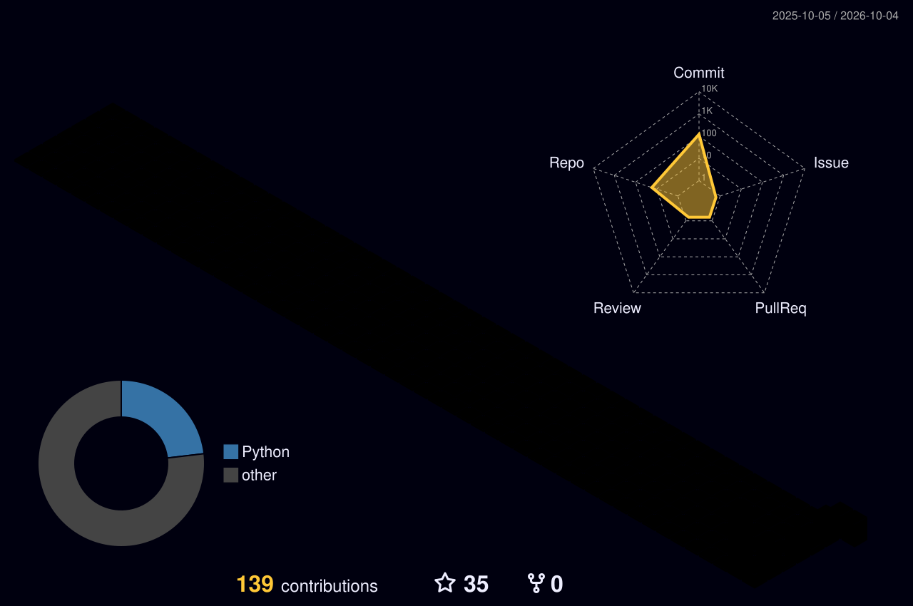

 

 

 

<picture>
  <source media="(prefers-color-scheme: dark)" srcset="./profile-snake-contrib/github-contribution-grid-snake-dark.svg" />
  <source media="(prefers-color-scheme: light)" srcset="./profile-snake-contrib/github-contribution-grid-snake.svg" />
  
</picture>

## Miles Chen

脚本、命令行，以及能长期跑着的小工具。重复的检查写成代码：配置在导入之前先过一遍，分享链接在本机解析。

## 在维护

- [envfile](https://github.com/ivel-mind/envfile) — 读写 `.env`
- [retrybox](https://github.com/ivel-mind/retrybox) — 固定次数重试
- [clash-config-lint](https://github.com/ivel-mind/clash-config-lint) — 导入前检查 Clash Meta 配置
- [proxy-uri](https://github.com/ivel-mind/proxy-uri) — 本机解析分享链接，不打印凭据

## GitHub Overview

## 3D Contributions

<picture>
  <source media="(prefers-color-scheme: dark)" srcset="./profile-3d-contrib/profile-night-rainbow.svg" />
  <source media="(prefers-color-scheme: light)" srcset="./profile-3d-contrib/profile-season-animate.svg" />
  
</picture>

## Followers

## Full-Year Contributions

